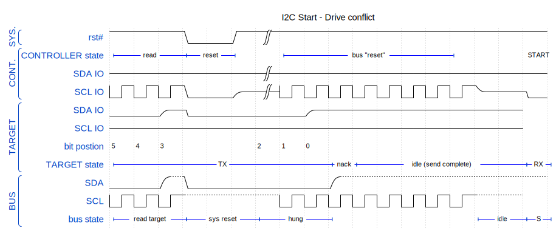
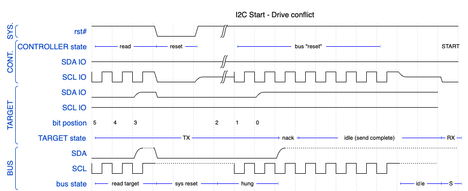

# I2C Bus hang after controller reset

## About the Scenario

The I2C bus can get hung when the target device is not reset when the controller is.

This situation can occur when the circuit does not support hardware reset to the I2C target peripheral.

Some I2C peripherals do not have a reset pin, but in such cases, the associated power supply could be disabled during board reset.

The failure occurs during a read cycle, when data is low and the controller experiences a reset (hardware or software).
The controller state machine resets to idle,
but the target is still in transmit state, holding SDA low.

Since the controller is required to strobe SDA low while SCL is high to start a transaction,
but the target is holding the SDA line low,
no I2C transaction can start.

The solution is to strobe SCL enough times to complete the read transaction.
This is,
at worst case,
9 clock cycles of SCL.
We need to ensure we clock out 8 bits of data, and then the acknowledgement bit.

## About the Diagram

The diagram uses many features of Wavedrom, and is left as an example for you to explore.

You can play with this diagram using by following [this link](https://wavedrom.com/editor.html?%7B%0A%20%20%20%20head%3A%7Btext%3A%27I2C%20Start%20-%20Drive%20conflict%27%7D%2C%0A%20%20%20%20signal%3A%20%5B%0A%09%20%20%5B%27SYS.%27%2C%0A%20%20%20%20%20%20%7Bname%3A%20%27rst%23%27%2C%20%20%20%20%20%20wave%3A%20%271..0.1%7C...........%27%20%7D%2C%0A%20%20%20%20%20%20%5D%2C%0A%0A%20%20%20%20%20%20%5B%27CONT.%27%2C%0A%20%20%20%20%20%20%7Bname%3A%20%27CONTROLLER%20state%27%2C%20node%3A%20%27L..M.N.O......P%20%20QR%27%7D%2C%0A%20%20%20%20%20%20%7Bname%3A%20%27SDA%20IO%27%2C%20%20%20%20%20%20%20%20%20%20%20wave%3A%20%27z.....%7C...........%27%20%7D%2C%20%0A%20%20%20%20%20%20%7Bname%3A%20%27SCL%20IO%27%2C%20%20%20%20%20%20%20%20%20%20%20wave%3A%20%27n..0.z%7Cn.......z.0%27%20%7D%2C%0A%20%20%20%20%20%20%5D%2C%0A%20%20%20%20%20%20%5B%27TARGET%27%2C%0A%20%20%20%20%20%20%7Bname%3A%20%27SDA%20IO%27%2C%20%20%20%20%20%20%20wave%3A%20%270.z0....z........%27%20%7D%2C%20%0A%20%20%20%20%20%20%7Bname%3A%20%27SCL%20IO%27%2C%20%20%20%20%20%20%20wave%3A%20%27z................%27%20%7D%2C%0A%20%20%20%20%20%20%7Bname%3A%20%27bit%20postion%27%2C%20%20%20%20%20%20%20%20%20%20node%3A%20%27543...210%27%7D%2C%0A%20%20%20%20%20%20%7Bname%3A%20%27TARGET%20state%27%2C%20node%3A%20%27W......%20.XY%20%20%20%20%20%20ZV%27%7D%2C%0A%20%20%20%20%20%20%5D%2C%0A%20%20%20%20%20%20%5B%22BUS%22%2C%0A%20%20%20%20%20%20%7Bname%3A%20%27SDA%27%2C%20%20%20%20%20%20%20wave%3A%20%270.u0.....u........%27%20%7D%2C%20%0A%20%20%20%20%20%20%7Bname%3A%20%27SCL%27%2C%20%20%20%20%20%20%20wave%3A%20%27n..u...nnnnnnnnu.%27%20%7D%2C%0A%20%20%20%20%20%20%7Bname%3A%20%27bus%20state%27%2C%20node%3A%20%27A..B..C..D.....E%20FH%27%20%7D%2C%0A%20%20%20%20%20%20%5D%0A%20%20%5D%2C%0A%20%20%20%20%20%20edge%3A%20%5B%0A%20%20%20%20%20%20%20%27L%2BM%20read%27%2C%20%27M%2BN%20reset%27%2C%20%27O%2BP%20bus%20%22reset%22%27%2C%27Q%2BR%20START%27%2C%0A%20%20%20%20%20%20%20%27W%2BX%20TX%27%2C%20%27X%2BY%20nack%27%2C%20%22Y%2BZ%20idle%20(send%20complete)%22%2C%27Z%2BV%20RX%27%2C%0A%20%20%20%20%20%20%20%27A%2BB%20read%20target%27%2C%20%27B%2BC%20sys%20reset%27%2C%20%27C%2BD%20hung%27%2C%27E%2BF%20idle%27%2C%20%27F%2BH%20S%27%2C%0A%20%20%20%20%5D%2C%0A%20%20%20%20%20%20%0A%20%20%20%20config%3A%20%7Bhscale%3A1%7D%0A%20%20%7D).

If you care to read the source markdown of this file, you will see the URL embeds the whole diagram. This link was generated using the `expand url` option in the lower left of the Wavedrom editor page.

## About the Images

The SVG and PNG renderings are provided so you can see the value of SVG over PNG when embedding into web pages and documents.

	<figure>
		
		<figcaption><b>Figure 1:</b> SVG rendering of the I2C bus hang scenario.</figcaption>
	</figure>
	 
	<figure>
		
		<figcaption><b>Figure 2:</b> PNG rendering of the I2C bus hang scenario.</figcaption>
	</figure>

The original PNG is 920 pixels wide, and both images are constrained to 400 pixes for rendering.
You may see the SVG is sharper than the PNG.
This difference becomes more apparent when you have to resize the images for use in PDF documents, PowerPoint presentations, and web assets.

Both were exported from the Wavecom on-line editor.

## Use of these illustrations

This illustration was used in a book project which I shared on [LeanPub](https://leanpub.com/theguidetoi2cdebugging).

A similar illustration appears in one of my [blog posts](https://glorifiedplumbing.blog/2023/11/13/an-adventure-in-debugging-an-i2c-bus-hang/) about I2C bus hangs.

## More about Wavedrom

I posted a brief comparison of WaveDrom and PlantUML on my [blog](https://glorifiedplumbing.blog/2023/11/06/how-i-draw-simple-timing-diagrams/), 
which you may be interested in reading.